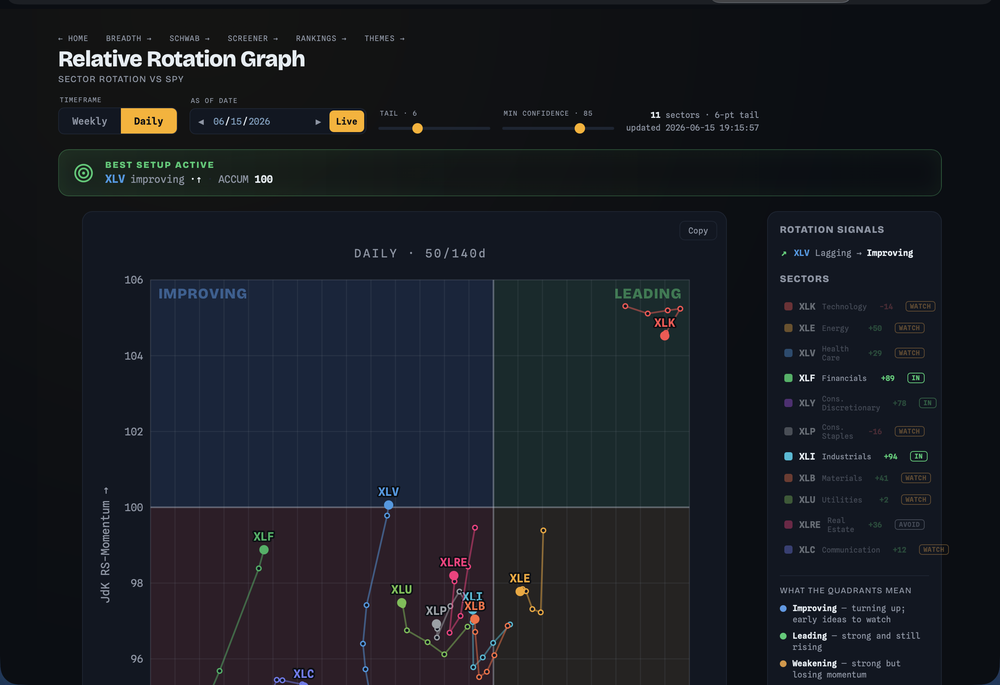
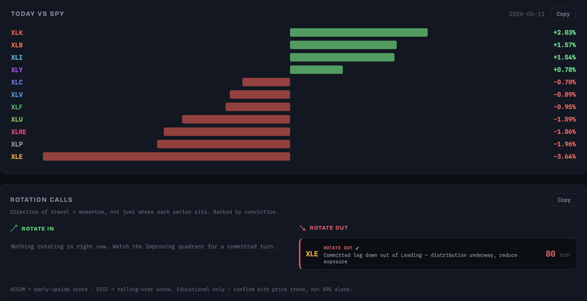

# Market Intelligence Harness — Local Market Analytics

A personal market intelligence platform that runs entirely on your Mac. A tiny Python server fetches data and serves an interactive dashboard at `localhost` — no cloud, no subscriptions, no API fees for the core data. Built module by module, each a self-contained package with its own page.

<p align="center">
  
</p>

---

## Modules

Each module has its own README with the full nuts-and-bolts deep dive.

| Module | What it does | Deep dive |
|---|---|---|
| **Home** | Hub page linking every module, with live status badges | [modules/home](modules/home/README.md) |
| **RRG** | Interactive Relative Rotation Graph for sector ETFs — rotation calls per sector | [modules/rrg](modules/rrg/README.md) |
| **Breadth** | Market breadth tracker: McClellan, A-D lines, % above MAs / short-term EMA thrust, regime & divergences across swappable universes (S&P 500 / NYSE / Nasdaq) | [modules/breadth](modules/breadth/README.md) |
| **Schwab** | Account positions enriched with daily sector rotation signals (BUY / HOLD / SELL) | [modules/schwab](modules/schwab/README.md) |
| **Screener** | TradingView-style screener over the whole market (incl. EMA & golden-pocket filters) + watchlists + intraday pump/dump alerts (Discord / email) + a **strategy backtester** | [modules/screener](modules/screener/README.md) |

### RRG — direction of travel, not just position

The [RRG module](modules/rrg/README.md) plots each sector's relative strength vs SPY and turns its *direction of travel* into explicit ROTATE IN / OUT / HOLD / AVOID / WATCH calls, with a vs-SPY bar chart and a ranked rotation-calls panel.

<p align="center">
  
</p>

### Screener — scan, watch, get alerted

The [Screener module](modules/screener/README.md) filters ~5,300 symbols with savable screens, builds watchlists, and raises same-day pump/dump alerts on your positions and watchlist names — in-app and optionally to Discord/email. Filters include price-vs-EMA distances (5/10/20/50/100/200) and a **golden-pocket** scanner (price in / approaching the 0.618–0.786 Fibonacci retracement of the latest swing, both directions).

<p align="center">
  
</p>

### Backtester — validate a confluence before you trade it

The screener doubles as a **strategy backtester**: take your current screen conditions as an entry signal and replay them over history (long-only, next-open fills, no lookahead). It reports win rate, expectancy, profit factor, forward returns at +1/5/10/20 days vs SPY, and an equity curve — exportable to Markdown. Built so a machine-learning ranking layer can train on the per-trade signal features later.

<p align="center">
  
</p>

---

## One-time setup

You need Python 3 (macOS ships with it). Install the dependencies:

```bash
pip3 install yfinance pandas numpy requests
```

The RRG module works with no configuration — it only needs Yahoo Finance, which requires no key.

**For the Schwab, Breadth, and Screener modules**, create a `.env` file in the project root (copy `.env-example`):

```bash
cp .env-example .env
```

Then fill in your Schwab developer credentials from [developer.schwab.com](https://developer.schwab.com) — create an app with `https://127.0.0.1` as the redirect URI:

```
SCHWAB_CLIENT_ID=your_app_key
SCHWAB_CLIENT_SECRET=your_app_secret
SCHWAB_URI=https://127.0.0.1
```

Optional — the Screener can route alerts to Discord and email; add these only if you want external delivery (see the [Screener README](modules/screener/README.md#delivery--channel-routing)):

```
DISCORD_WEBHOOK_URL=...
SMTP_HOST=smtp.gmail.com
SMTP_PORT=465
SMTP_USER=you@gmail.com
SMTP_PASS=your_app_password
ALERT_EMAIL_TO=you@gmail.com
```

---

## Run

```bash
cd rrg-tool
python3 app.py
```

Then open **http://localhost:8000**. Press `Ctrl+C` in the terminal to stop.

| Page | URL |
|---|---|
| Home — Module Hub | http://localhost:8000/ |
| RRG — Sector Rotation | http://localhost:8000/rrg.html |
| Breadth — Market Breadth | http://localhost:8000/breadth.html |
| Schwab — Account Positions | http://localhost:8000/schwab.html |
| Screener — Stock Screener | http://localhost:8000/screener.html |

> **Data note:** the core data comes from Yahoo Finance via `yfinance` (free, no key, but unofficial — the occasional hiccup is normal; just reload) and, where you've connected Schwab, the Schwab Market Data API. Everything is educational only — confirm with price trend, not these tools alone.

---

## Architecture

One `modules/<name>/` folder per data domain; `app.py` owns only the HTTP server and routing (no business logic). Each module exposes a single `register_routes(router)` function and ships its own HTML frontend.

```
app.py                  # ThreadingHTTPServer + router
modules/
  home/                 # hub homepage + live status badges
  rrg/                  # RRG math + chart
  breadth/              # breadth indicators + dashboard + SQLite store
  schwab/               # Schwab OAuth + positions
  screener/             # screener + watchlists + alerts + SQLite store
tests/                  # stdlib unittest — /usr/bin/python3 -m unittest discover tests
```

Adding a new module is three steps: create the folder, add a `register_routes(router)` function, import it in `app.py`. Modules are mostly independent; the few intentional cross-imports (Schwab owns OAuth and the RRG calls feed Schwab + Screener signals) are documented in each module's README.

Run the test suite with:

```bash
/usr/bin/python3 -m unittest discover tests
```
