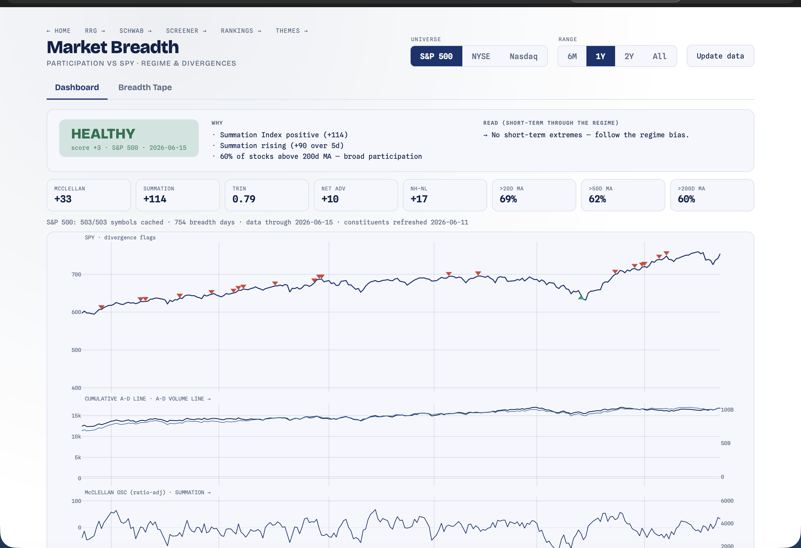
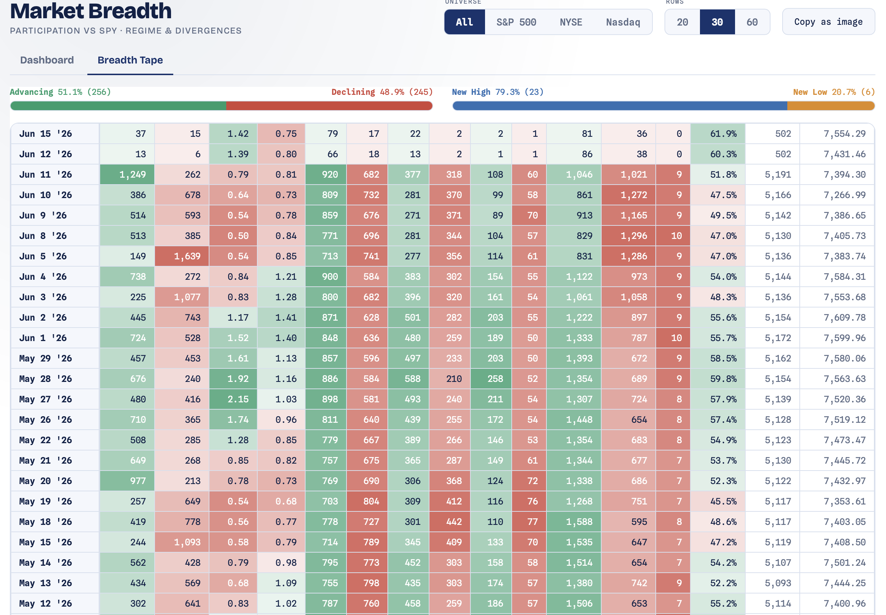

# Breadth — Market Breadth Tracker

[← Back to main README](../../README.md)

Answers one question continuously: **is the broad market participating in a move, or is it being carried by a handful of large stocks?** Designed for short-term S&P timing (SPY/ES), with long-term breadth as a regime layer that colors how the short-term signals are read — breadth is always shown against index price on a shared time axis, because breadth in isolation is close to useless.

<p align="center">
  
</p>

Open at **http://localhost:8000/breadth.html**.

---

## Regime banner

The top of the dashboard states the current regime, derived from the long-term panel:

| Regime | Meaning |
|---|---|
| **HEALTHY** | Summation Index positive *and* rising *and* >60% of stocks above their 200d MA — oversold readings are buy-the-dip setups, can size up |
| **NEUTRAL** | Mixed long-term panel — wait for confirmation |
| **DETERIORATING** | Narrow market (<50% above 200d), falling Summation, or active divergences — the same oversold readings get faded, smaller size, tighter stops |

The regime is scored (Summation sign + 5-day slope + % above 200d − active divergence flags); `≥3 → HEALTHY` (all legs green required), `≤−2 → DETERIORATING`, else NEUTRAL. Thresholds are named constants at the top of `regime.py` — tune there.

**Divergence flags** are discrete dated events (not just lines): the index making a fresh ~quarterly (63-day) high while the A-D line or % above 50d/20d MA fails to confirm raises a bearish flag (bullish mirror at lows). Active flags subtract from the regime score and are marked on the price panel; they stay "active" for 21 bars.

The `interpret()` step maps a short-term extreme *through* the regime — an oversold McClellan in a HEALTHY tape is a buy-the-dip; the identical print in a DETERIORATING tape is a fade, smaller, tighter.

---

## Panels (shared time axis)

1. **Index price** with divergence markers and Zweig Breadth Thrust events
2. **Cumulative A-D line** + A-D volume line
3. **McClellan Oscillator** (ratio-adjusted) + Summation Index
4. **% of stocks above 20/50/200-day MA**
5. **% of stocks above 5/10/20-day EMA** — short-term thrust that leads the slower SMA panel
6. **TRIN (Arms Index)** + up/down volume ratio
7. **52-week new highs − new lows** + High-Low Index
8. **Concentration gauge** — RSP/SPY ratio (equal-weight vs cap-weight; falling = top-heavy market)

---

## Breadth Tape — Market Monitor

A second **tab** on the breadth page (toggle "Dashboard ⟷ Breadth Tape" at the top of
**http://localhost:8000/breadth.html**) that reproduces the Stockbee-style "Market Monitor": a
dense daily table, newest day on top, of raw cross-sectional counts with each cell green/red
heat-colored, plus Advancing/Declining and New-High/New-Low gauge bars and a **Copy as image**
button (renders the tape to a PNG and writes it to the clipboard; downloads as a fallback).

<p align="center">
  
</p>

Columns: **Up/Down 4%+ Today**, **5/10 Day Ratio** (Σ up4% / Σ down4%), **Up/Down 25%+ Quarter**
(65d), **Up/Down 25%+ & 50%+ Month** (20d), **Up/Down 13%+ 34 Days**, **10× ATR Ext.** (close
≥10×ATR(14) above its SMA50), **>50dma** (% above the 50-day SMA), **Stock Universe** (eligible
count), and **S&P** (^GSPC close). Same eligible-denominator discipline as the dashboard
aggregates.

Scope toggle: **All** (NYSE ∪ Nasdaq, default — broad enough for hundreds-of-stocks counts;
S&P 500 alone is single-digit) / S&P 500 / NYSE / Nasdaq. Computed on demand from stored bars
(`indicators.market_monitor`), memoized until the next sync. `^GSPC` is fetched lazily via
yfinance and cached in `bars`. Endpoint: `GET /api/breadth/tape?universe=&rows=`.

---

## Universes

Swappable at runtime via the buttons in the header: **S&P 500** (Wikipedia constituents), **NYSE** and **Nasdaq** (nasdaqtrader.com listings, common stock only — warrants/units/preferreds filtered by name). Universes are defined in `universes.json` — adding Russell 2000 or S&P 600 is a config entry (a generic CSV fetcher is included), no code changes.

**Survivorship caveat (important):** universes are built from *today's* constituent lists, so deep historical breadth is biased upward — delisted losers are missing. Recent readings are reliable; treat multi-year history as approximate. Membership is stored dated (`first_seen`/`last_seen`) so point-in-time lists can be imported later. The caveat is shown on the dashboard and in summaries.

---

## Data & backfill

- Prices come from the **Schwab Market Data API** by default (free with your existing developer app; the OAuth tokens from the Schwab module are reused), with **yfinance as automatic fallback** when Schwab isn't connected. Adapters are pluggable (`datasource.py`).
- Everything lands in a local **SQLite store** (`data/breadth.db`, gitignored, WAL mode); indicators always compute from local data, never by re-pulling history.
- The first backfill per universe pulls 3 years of daily bars — ~5 min for the S&P 500, 20–40 min for NYSE/Nasdaq via Schwab (rate-limited to stay under 120 requests/min). It runs in a **background daemon thread** with a progress bar (this is why `app.py` uses a threading server — a sync must not block the dashboard), is **resumable** (interrupt and re-run — already-synced symbols are skipped via `sync_state`), and subsequent updates are incremental with a 7-day overlap re-fetch.

### Math notes

- **McClellan is ratio-adjusted** (`rana = 1000·(adv−dec)/(adv+dec)`, osc = EMA19−EMA39) so readings are comparable across a 500-stock and a 3,000-stock universe — a deliberate deviation from the classic raw-net-advances form, because universes are runtime-swappable and the regime thresholds must be scale-independent.
- **Summation Index uses the closed form `19·EMA39 − 9·EMA19`, not `cumsum(osc)`.** A plain cumsum carries a permanent artifact from the arbitrary first day of stored history (found live: a positive-breadth market reading deeply negative). The closed form's increment still equals the oscillator exactly.
- **% above MA / new highs-lows** use per-day *eligible counts* as denominators (a symbol needs 200 bars before it counts for % above 200d) — keeps young listings from distorting the percentages.
- **Short-term EMA thrust** — count and % of names above their 5/10/20-day EMA (`n_above_{5,10,20}ema` / `pct_above_{5,10,20}ema`), same eligible-denominator discipline as the SMA block. These backfill on the next sync's recompute from stored bars (no re-download).
- The Bullish Percent Index is stubbed — it needs a point-&-figure signal engine.

---

## Daily summary CLI

```bash
python3 -m modules.breadth.cli            # S&P 500 summary
python3 -m modules.breadth.cli nasdaq     # another universe
python3 -m modules.breadth.cli --json     # machine-readable
```

Prints the current regime with reasons, short-term extremes interpreted *through* the regime, and any active divergence flags. Same code path as `/api/breadth/summary` and the homepage badge.

---

## Files

| File | Role |
|---|---|
| `__init__.py` | route handlers + dashboard/summary assembly |
| `datasource.py` | `SchwabDataSource` / `YFinanceDataSource` adapters + rate limiter |
| `store.py` | SQLite store (bars, members, sync_state, computed series) |
| `universes.py` / `universes.json` | constituent fetchers + swappable config |
| `backfill.py` | resumable background sync job |
| `indicators.py` | pure pandas breadth math incl. `market_monitor` (the Breadth Tape) — unit-tested in `tests/` |
| `regime.py` | regime state + divergence detection + interpretation |
| `cli.py` | daily summary printout |
| `breadth.html` | dashboard (Plotly) + Breadth Tape tab (heat-colored table) |
