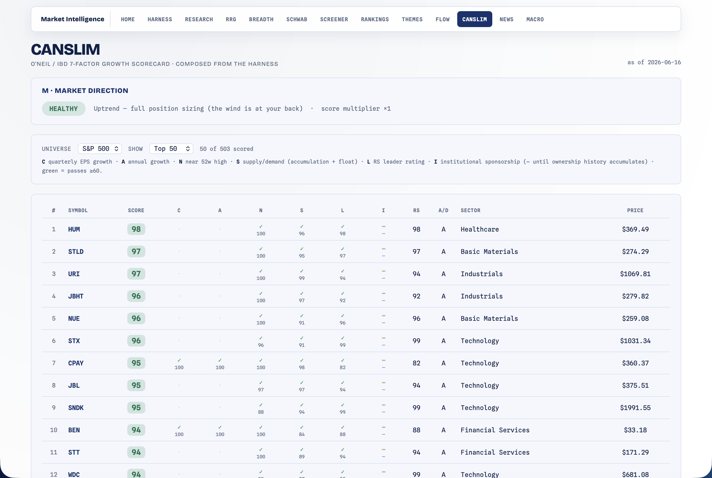

# CANSLIM — Growth Scorecard

[← Back to main README](../../README.md)

  

William O'Neil / IBD's classic **7-factor growth-stock scorecard** (C-A-N-S-L-I-M), turned into a **0-99 leaderboard** with a per-stock letter breakdown and a market-direction banner. It answers: *which growth names are scoring well across all seven factors, and is the overall market in gear to own them?*

Open at **http://localhost:8000/canslim.html**. Reads from the [Screener](../screener/README.md)'s synced snapshot + fundamentals and the [Breadth](../breadth/README.md) regime — no new downloads.

---

## The whole module is composition, not new quant

Like [Themes](../themes/README.md), CANSLIM adds no new math — each of the seven letters is read from a signal another module already produces and blended into a composite. Each letter is scored 0–100:

| Letter | Means | Read from |
|---|---|---|
| **C** | Current quarterly EPS growth | Screener `fundamentals.eps_growth_q` vs a +25% target |
| **A** | Annual EPS growth | Screener `fundamentals.eps_growth_a` |
| **N** | New high / new product | Screener `pct_from_52w_high` (full within ~5% of the high) |
| **S** | Supply & demand | the [Confluence](../confluence/README.md) **`ad_rating`** (accumulation A→100 … E→0), blended with a small-float bonus |
| **L** | Leader (not laggard) | a **cross-sectional RS rating** (percentile of the RS blend over the whole universe — IBD's RS-Rating idea) |
| **I** | Institutional sponsorship | the Confluence **`institutional`** leaf over the screener's dated ownership history (% held + holder-count QoQ trend) |
| **M** | Market direction | the Breadth regime — used as a per-stock **multiplier** + a banner, *not* a column |

### The composite

`_composite` is a `LETTER_WEIGHTS`-weighted average (C .20 / A .15 / N .15 / S .15 / L .25 / I .10) **renormalized over the letters that are actually available**, then multiplied by the market factor (HEALTHY 1.0 / NEUTRAL 0.85 / DETERIORATING 0.6 — don't fight the tape) → a 0-99 score. **Fail-soft everywhere**: a missing letter just drops out of the blend, so the page works before fundamentals finish syncing. A per-letter `pass` flag fires at ≥ 60.

---

## Caveats (surfaced in the UI)

- **Latest-known fundamentals**, not point-in-time.
- **Today's universe membership** (survivorship).
- Needs a **built screener snapshot + synced fundamentals** to populate C / A / S / I.
- **I is forward-accumulating** — it only scores once the ownership store holds two dated reads (so a QoQ delta exists). Same freshness honesty as the screener backtester.

---

## Routes

| Method | Path | Purpose |
|---|---|---|
| GET | `/canslim.html` | the page |
| GET | `/api/canslim?universe=&limit=` | market block + scored leaderboard + note |
| GET | `/api/canslim/summary` | top name + composite (drives the hub badge) |

## Files

| File | Role |
|---|---|
| `__init__.py` | the 7 letter scorers + composite + routes (reads screener / breadth / rankings) |
| `canslim.html` | market-direction banner + the 0-99 leaderboard with the C-A-N-S-L-I-M scorecard (white/navy) |

Unit tests live in [`tests/test_canslim.py`](../../tests/test_canslim.py).

> Educational only. A high CANSLIM score is a screen, not a buy signal — confirm with price trend and your own due diligence.
