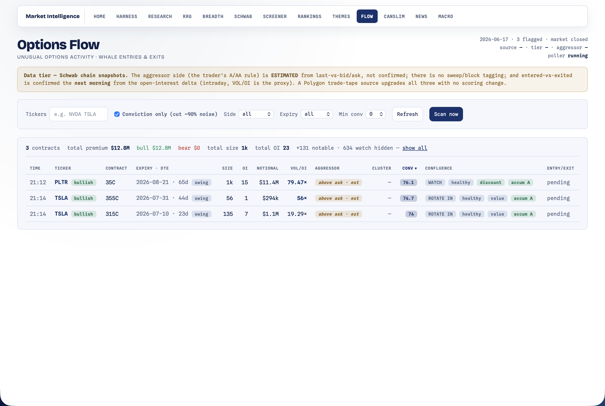

# Flow — Options Flow

[← Back to main README](../../README.md)

  

Surface **unusual options activity** — when whales open or close large positions — and cut through the noise (≈90% of flow is hedges, spreads, rolls, and exits). It encodes a successful flow trader's **6-rule filter** over option-chain snapshots and shows a feed of the prints that actually matter, each with a per-contract factor breakdown.

Open at **http://localhost:8000/flow.html**. Needs a connected [Schwab](../schwab/README.md) account (it reads option chains via the Schwab Market Data API).

---

## What it shows

A feed of scored option-contract activity with a default-ON **"conviction only"** toggle (the 90%-noise cut), per-rule filters, an entry/exit column, and a per-contract **factor drill-down** that explains exactly why each print scored the way it did. Each row carries:

- **Conviction** (0–100) and a **classification** bucket — `noise` / `watch` / `notable` / `conviction`.
- A signed **direction** (bullish / bearish) inferred from contract type + estimated aggressor.
- An **ESTIMATED-aggressor** badge (see caveats) and **confluence chips** (the Rule-6 context).
- **Entered vs exited** — resolved the next morning from the open-interest delta.

---

## The 6 rules

Each rule is a named-constant gate in `scoring.py` (pure, unit-tested). `classify_contract` returns conviction + a bucket + direction + a factor breakdown; a hard-gate failure short-circuits to `noise` with the reason.

| # | Rule | What it checks |
|---|---|---|
| 1 | **Aggressive buy** | `last` vs bid/ask → an **estimated** aggressor (advisory only on snapshots, never a gate; a real trade tape would make it a confirmed gate) |
| 2 | **Size in context** | premium notional ≥ a floor **and** ≥ a multiple of the ticker's *own* average daily options notional **and** large vs open interest |
| 3 | **VOL vs OI** | VOL < OI = churn (dropped); ≥5× interesting; ≥20× fresh money. The next-morning OI delta resolves entered vs exited |
| 4 | **Form** | repeated prints (**clusters**) detected from snapshot diffs (sweeps/blocks need a trade tape) |
| 5 | **Timeframe** | favor swings; deprioritize 0DTE and insane-OTM lottos |
| 6 | **Confluence** | sector RRG call + breadth regime + golden pocket + volume-profile value area — annotate + a soft boost, never a hard suppress |

---

## How it runs

A singleton daemon poller (`poller.py`, market-hours gated, ~90s tick) does each pass:

1. Build the universe — `merge_universe(focus_list())` = a curated liquid-options seed ∪ your Schwab positions ∪ watchlists.
2. Pull each underlying's option chain (`source.get_chain`) and **diff** it against the prior snapshot in the store for volume deltas + clusters.
3. Score each contract with `scoring.classify_contract`, attaching the Rule-6 confluence (`context.build_context`, batched + fail-soft).
4. Persist non-`noise` signals and dispatch `notable`+ alerts (reusing the [Screener](../screener/README.md)'s Discord/SMTP senders, with `flow_channels` routing).

The first pass of a new day runs **`confirm_entries`** — the next-morning open-interest confirmation that resolves the prior day's signals into `opened` / `closed` / `flat`.

---

## Pluggable data source

`source.py` mirrors the breadth datasource pattern. The `OptionsFlowSource` interface exposes `get_chain` + `get_trades` + capability flags (`supports_aggressor` / `supports_trade_tape`):

- **`SchwabOptionsSource`** (default) — parses `GET /marketdata/v1/chains` into normalized contracts.
- **`PolygonOptionsSource`** — an inert pluggable stub. A future Polygon **trade tape** would turn the two tape-only signals (confirmed aggressor, sweeps/blocks) on with **zero scoring change** — the engine is built for it.

> **Note:** Polygon's free tier covers news (used by the [News](../news/README.md) module) but **not** options data — the options tape/chains are a paid plan, so flow stays on Schwab snapshots.

---

## Honest caveats (surfaced in the UI)

Schwab gives **snapshots, not the tape** — so the aggressor is *estimated*, there are no sweep/block prints, and sub-tick activity is missed. Open interest prints once a day, so entered vs exited is a **T+1** read (intraday VOL/OI is the proxy). The Polygon upgrade path closes all three with no engine change.

---

## Routes

| Method | Path | Purpose |
|---|---|---|
| GET | `/flow.html` | the page |
| GET | `/api/flow/feed` | scored flow signals |
| GET | `/api/flow/contract` | per-contract factor drill-down |
| GET | `/api/flow/summary` | hub badge |
| GET | `/api/flow/status` | poller / source status |
| POST | `/api/flow/sync` | force a poll pass |
| POST | `/api/flow/settings` | alert channel routing etc. |
| POST | `/api/flow/poller` | start/stop the daemon |

## Files

| File | Role |
|---|---|
| `__init__.py` | feed/payload assembly + routes (starts the poller) |
| `scoring.py` | the pure 6-rule filter → conviction / classification / factors |
| `source.py` | `OptionsFlowSource` interface + Schwab/Polygon adapters + `resolve_source` |
| `context.py` | Rule-6 confluence per underlying (RRG call + breadth + golden pocket + volume profile) |
| `universe.py` | curated liquid-options seed + `merge_universe(focus)` |
| `store.py` | SQLite store (contract_state, flow_signal, oi_history, ticker_baseline, flow_alert) |
| `poller.py` | intraday daemon: poll → diff → score → alert + the next-morning OI confirmation |
| `notify.py` | reuses the screener's senders; `flow_channels` routing |
| `flow.html` | feed + filters + per-contract drill-down (white/navy) |

Unit tests: [`tests/test_flow_scoring.py`](../../tests/test_flow_scoring.py), [`tests/test_flow_store.py`](../../tests/test_flow_store.py).

> Educational only. Options flow is a *context* read full of false positives — confirm with price trend and never treat a single print as a signal.
