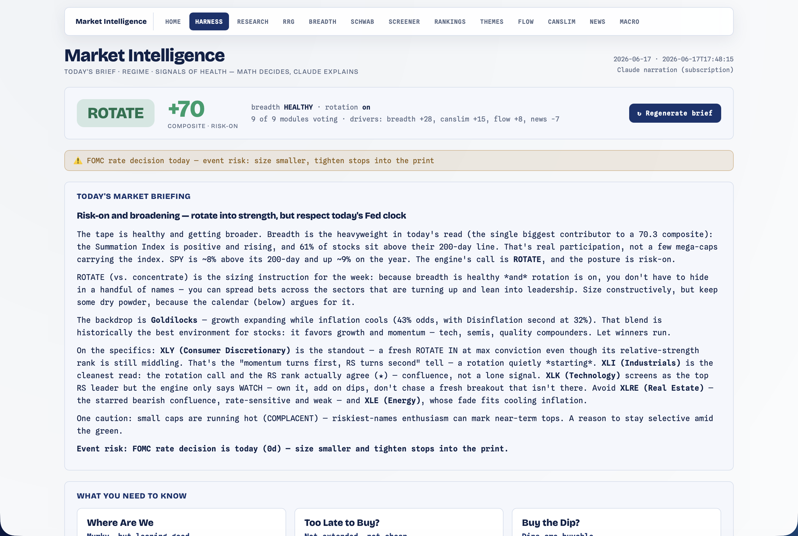

# Harness — Market-Intelligence Dashboard

[← Back to main README](../../README.md)

  

The **synthesis layer and the project's end-goal**. The Harness is the *absolute top consumer*: it turns every data module's signal into a signed **vote**, combines them **deterministically**, arbitrates by regime, and has Claude **narrate** the result into one daily brief — an AskLivermore-style market-intelligence dashboard. It then takes a TradingView watchlist and runs a cost-modeled **paper-trading** book on its picks.

Open at **http://localhost:8000/harness.html**. Works fully offline at **$0** from the deterministic combiner alone; the LLM narration is optional (see [the LLM layer](#the-llm-layer)).

> **The guiding finding:** no single module has standalone forward alpha in a concentration regime, so the edge is **confluence + regime arbitration** — *concentrate when breadth is narrow, rotate when it's broad* (detect-and-adapt, not "beat the regime").

---

## Math decides, the LLM explains

Two layers, deliberately separated:

1. **The combiner is the decision** (`combiner.py`) — **deterministic and LLM-free**, so it's replayable and backtestable by the referee, and runs at $0/offline.
2. **The LLM only explains it** (`agents.py`) — it narrates the combiner's number/stance and surfaces cross-domain agreement/conflict, *anchored* to the math (it never overrides it).

This split is what protects the validated finding — only deterministic decisions can be scored by the referee.

---

## The vote → combiner → brief pipeline

### Votes (`votes.py`)

One **fail-soft** `vote_<domain>()` per module, each a lazy in-function reuse of that module's existing entrypoint (no new quant). A vote is `{domain, scope, direction (+1/0/−1), conviction (0-100), weight, factors[], horizon, regime_context, rationale, ok, detail}`. A module with no data abstains (`ok=False`) and is skipped, so the harness degrades gracefully as the breadth backfill / screener snapshot come online.

| Domain | Weight | Role |
|---|---|---|
| **breadth** | 30 | the regime **arbiter** (HEALTHY +1 / DETERIORATING −1) |
| **macro** | 18 | the growth×inflation regime's probability-weighted equity tilt |
| **rrg** | … | net bullish-vs-bearish sector call conviction + the rotation gate |
| **rankings / canslim** | … | offensive-vs-defensive leadership tilt / growth-leader strength |
| **flow / screener / themes / news** | … | whale direction / alert balance / top theme / event-risk damper |

### Combiner (`combiner.py`)

Sums `direction × conviction/100 × weight × stance_factor`, clamps to ±100 → `{score, posture, stance, factors, longs, avoids}`. **Regime arbitration is applied last**: `decide_stance(regime, rotation)` → **ROTATE** (HEALTHY + rotation-on) / **CONCENTRATE** (deteriorating or rotation-off) / NEUTRAL. In CONCENTRATE the RRG *rotation* bet is halved (the validated finding) and leadership votes are leaned into. **`_sector_confluence`** gives a sector that RRG calls bullish **and** rankings ranks highly a ×1.25 agreement bonus, so confluence outranks a lone signal → the `longs` / `avoids` chips.

### The brief (`agents.py`)

A plain-English daily brief with a punchy headline, woven through the macro regime + market health, narrated by Claude — or a deterministic template when the LLM is unavailable.

---

## The LLM layer

`agents.py` runs on the user's **Claude subscription via the local `claude` CLI** — *not* the metered API (no `ANTHROPIC_API_KEY`, no per-token cost, no new dependency). `claude_cli()` shells out headlessly (`claude -p --output-format json --model <m>`, prompt on stdin) and **fails soft to `None`** on a missing binary / timeout / error, so the brief falls back to a deterministic template.

- Models are env-overridable: `HARNESS_MASTER_MODEL` (default Opus 4.8), `HARNESS_DOMAIN_MODEL` (default Haiku 4.5). `HARNESS_LLM=0` forces the free path; `HARNESS_DOMAIN_LLM=1` narrates each domain.
- **Cost posture:** one master synthesis call per refresh by default. On-demand + cached (a 30-min memory TTL + a `data/brief_<date>.json` file), so a page load generates at most once/day and the hub badge reads the cache only — never an LLM call.

---

## Phase 2 — the Referee (`backtest.py`)

Validates the **combined** decision, not just one chart. It has the harness emit its own point-in-time `{call, conviction}` panel (`build_harness_calls`, the same shape as `signal.replay_calls`) and runs both that panel and the raw-RRG panel through the exact `rrg/backtest.py` machinery for an **A/B: harness confluence vs raw RRG vs SPY/RSP-matched beta**.

**Honest finding (11-ETF / 3y, a concentration regime — direction, not proof):** the harness does **not** beat beta on absolute return (the regime is mostly beta), **but regime-arbitrated confluence sharpens the *relative* signal vs raw RRG** (the long-hedged book and the ROTATE-IN forward excess are both better/less-negative than RRG's). That's signal-*quality*, not absolute alpha. It's a point-in-time **subset** (breadth regime + RRG + rankings + the rotation gate); flow/news/screener/canslim stay live-only refinements, and the LLM plays no part.

---

## Phase 3 — watchlist suggestions + paper trading

The confluence philosophy at the **stock** level. Upload a TradingView watchlist (CSV/.txt) as the trading focus; the app suggests which names have a strong **impulsive-move setup AND are solid to HOLD** if the move fails — not lottos.

- **IMPULSE (0-100)** — setup confluence (bull flag / golden pocket / breakout / RVOL / accumulation / RS / momentum − a buying-climax penalty), from the screener snapshot.
- **HOLD (0-100)** — `canslim.score_stock` **blended with the [Research](../research/README.md) module's per-ticker `fundamental_score`** (so a name's fundamental conviction flows into its size) × a quality floor.
- **PICK** = geomean(impulse, hold) × the combiner's regime factor with an event/earnings damper; **`tradeable`** requires *both* gates. Stop = close − 2·ATR.

`picks._rows` is hybrid — the screener snapshot when a symbol is in it, else yfinance OHLCV + `.info` on demand — so *any* watchlist works. The **paper engine** (`paper.py`) auto-trades the top picks across **two cost-modeled books** (long_only + hedged long−SPY); the **hedged book's cost-adjusted return vs SPY is the Phase-3 gate** (the relative edge surviving costs). An idempotent daily `step()` marks to market, honors the ATR stop, diffs to target, and persists positions/fills/equity. **Real broker order placement is out of scope** (paper only).

---

## Phase 4 — Trading Mode

A **Manual ⇄ Autonomous** toggle (`settings.trading_mode`):

- **Autonomous** — `paper_poller.py` (a singleton daemon) auto-runs `paper.step()` once per trading-day close so the gate accumulates on its own. A pure `is_due()` gate drives it; the daemon is a **no-op in manual mode** (auto-trading is opt-in, default unchanged).
- **Manual / AI-assist** — a **grounded chat** (`chat.py`): `answer()` assembles a compact JSON of the deterministic state (combiner decision + votes + paper state + cached suggestions + regime) and calls the LLM with a strict rule — *answer ONLY from the context, explain the math, never override it*. Fail-soft to a clear "assistant unavailable" message.

---

## The page

`harness.html` is the AskLivermore-style dashboard: the **stance banner** + plain-English **brief**, **"What You Need to Know"** cards, the **Market Regime** + **Market Health** panels, the **Leading + Macro indicator** tables, **Themes This Week**, and a **"Your Watchlist — Trade Suggestions"** panel — then an **"Engine Room"** divider below which sit the confluence chips, per-domain vote cards, the **Referee** A/B panel, the **Paper Trading** panel (Manual⇄Autonomous + both books + ▶ Step today), and the **Ask the Harness** chat. It composes fail-soft fetches (`/api/harness` + `/api/macro` + `/api/themes`) so a slow/missing module degrades one panel, never the page. It renders deterministically when `claude` isn't logged in.

---

## Routes

| Method | Path | Purpose |
|---|---|---|
| GET | `/harness.html` | the page |
| GET | `/api/harness` | the full brief payload (cached) |
| GET | `/api/harness/summary` | hub badge (stance + score + top long, cache-only) |
| POST | `/api/harness/run` | force-regenerate (re-runs the LLM) |
| POST | `/api/harness/backtest` | the referee A/B → JSON |
| GET/POST | `/api/harness/watchlist` | the focus list (POST imports a TradingView export) |
| GET | `/api/harness/picks` | ranked impulse×hold suggestions |
| GET | `/api/harness/paper` | both books + the gate + daemon/mode |
| POST | `/api/harness/paper/step` | idempotent daily step |
| POST | `/api/harness/paper/reset` | reset (`{confirm:true}`) |
| GET/POST | `/api/harness/mode` | Manual ⇄ Autonomous |
| POST | `/api/harness/chat` | `{message, history}` → grounded answer |

CLI: `python3 -m modules.harness.cli [--llm] [--json] [--backtest] [--import-watchlist PATH] [--picks] [--paper-step] [--paper] [--mode [manual|autonomous]] [--chat "q"]`.

## Files

| File | Role |
|---|---|
| `__init__.py` | `build_brief()` orchestration + memory/file cache + routes |
| `votes.py` | per-domain fail-soft vote adapters |
| `combiner.py` | the deterministic, LLM-free decision (confluence + regime arbitration) |
| `agents.py` | the `claude` CLI subprocess + master/domain prompts (fail-soft to templates) |
| `backtest.py` | the Phase-2 referee (A/B vs RRG vs beta) |
| `watchlist.py` / `picks.py` / `paper.py` | watchlist import → impulse×hold picks → paper books |
| `paper_poller.py` / `chat.py` | Phase-4 autonomous daemon + grounded AI-assist chat |
| `store.py` | SQLite (`data/trading.db`) for watchlist / paper books |
| `cli.py` | the standalone CLI |
| `harness.html` | the Market-Intelligence Dashboard (white/navy) |

Unit tests live across [`tests/test_harness*.py`](../../tests/) (no network; the `claude` subprocess, data loads, and paper prices are mocked/injected).

> Educational only. Paper trading is a simulation; the harness places no real orders. The referee finding is *direction, not precision* on a small sample — confirm with price trend.
