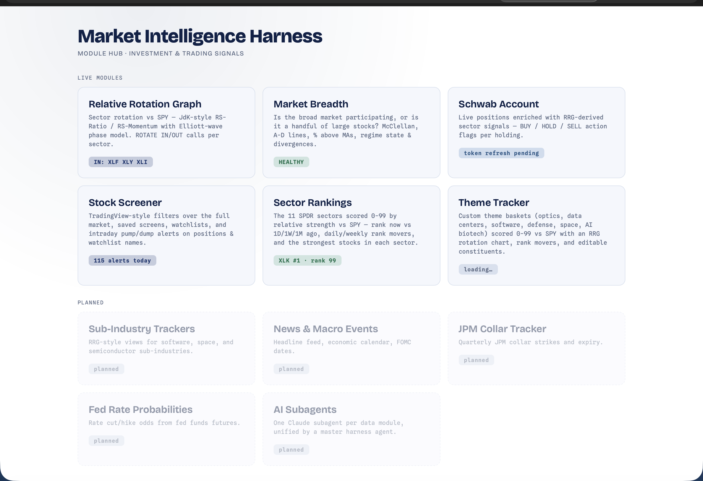

# Home — Module Hub

[← Back to main README](../../README.md)

  

The landing page at **http://localhost:8000/**. A simple hub of cards, one per module, each with a **live status badge** so you can see the state of everything at a glance before clicking in.

Each badge loads independently and **fails soft** — if one module's API is down or unconfigured, its badge reads "no data" / "unavailable" and the rest of the page still works.

| Badge | Endpoint | Shows |
|---|---|---|
| RRG | `/api/rrg` | sectors rotating in, else the top sector |
| Breadth | `/api/breadth/summary` | current regime (HEALTHY / NEUTRAL / DETERIORATING) |
| Schwab | `/api/schwab/status` | connection state (connected / refresh pending / not connected) |
| Screener | `/api/screener/alerts/summary` | alert count today, else the snapshot date |
| Rankings | `/api/rankings/summary` | the leading sector and its 0-99 rank |
| Themes | `/api/themes/summary` | the leading theme and its 0-99 rank |

Planned modules are shown as dashed "ghost" cards. Every live page shares a light white/navy theme (the RRG keeps its dark chart).

---

## Files

| File | Role |
|---|---|
| `__init__.py` | serves the hub homepage at `/` |
| `index.html` | module cards + async live status badges |

To add a card for a new module, drop an `<a class="card">` block into `index.html` and add a small `async` badge loader that hits the module's status endpoint and fails soft.
