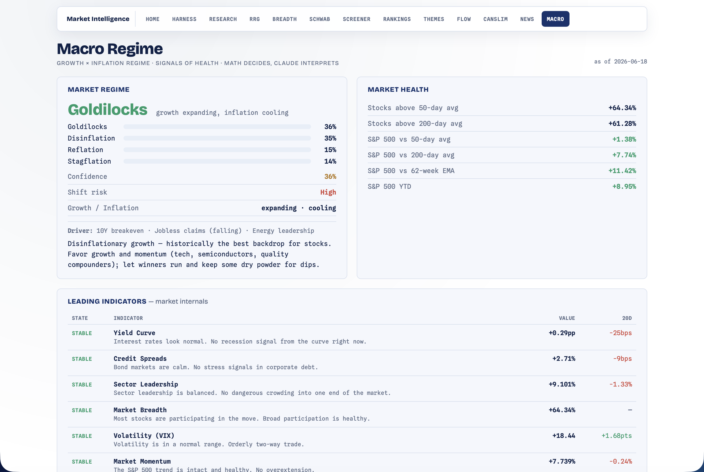

# Macro — Regime & Signals of Health

[← Back to main README](../../README.md)

  

The "signals of health" + macro-regime backend, modeled on **AskLivermore's** market-intelligence read (plain-English, regime-first). It classifies the **growth × inflation regime** as probabilities and tracks a panel of leading + macro indicators, each with a STABLE/COMPLACENT/WATCH/TURNED state and a plain-English meaning.

Open at **http://localhost:8000/macro.html** (the standalone detail page). The full AskLivermore-style dashboard that *uses* this is the [Harness](../harness/README.md) page. **Deterministic and $0** — the regime math + indicator states are pure/templated; an LLM only *interprets* them on the harness page.

---

## The growth × inflation regime classifier

The centerpiece (`regime.py`, pure — genuinely new quant). Two self-normalized z-score axes:

- **growth_z** — copper/gold momentum, *tight* credit spreads, cyclicals > defensives, small-cap risk appetite, *falling* jobless claims, breadth participation, Bitcoin liquidity, a weaker dollar.
- **inflation_z** — 10Y breakeven, copper, energy leadership, gold, a weaker dollar.

(The **US dollar feeds both axes** — a strong dollar is growth-negative *and* disinflationary, the reflation↔disinflation diagonal it actually drives.)

Each axis is mapped through a sigmoid → `p_g` / `p_i`, and the four quadrant probabilities are their **products**, so they sum to 1 by construction:

| Quadrant | Probability | Backdrop |
|---|---|---|
| **Goldilocks** | `p_g · (1−p_i)` | growth up, inflation down — supportive |
| **Reflation** | `p_g · p_i` | growth up, inflation up — supportive |
| **Stagflation** | `(1−p_g) · p_i` | growth down, inflation up — defensive |
| **Disinflation** | `(1−p_g) · (1−p_i)` | growth down, inflation down — defensive |

`classify()` returns the ranked probabilities + **confidence** (the top probability), **shift_risk** (Low/Moderate/High from the top-2 margin — Livermore's "razor-thin gap"), the **driver** (the strongest feature inputs), a per-quadrant plain-English **playbook**, and a probability-weighted **equity_tilt** that the harness vote consumes.

This is the **strategic** backdrop read — orthogonal to breadth's **tactical** HEALTHY/NEUTRAL/DETERIORATING regime (which stays the harness's stance arbiter).

---

## Signals of health — indicator panels

`indicators.py` builds two tables. Each row is `{value, unit, 20-bar Δ, state, plain-English meaning}`, where **state ∈ STABLE / COMPLACENT (too-good, stretched) / WATCH (mild caution) / TURNED (flipped/extreme)** and the *meaning* is a deterministic template per (indicator, state) — instant and $0.

- **Leading** (market internals): Yield Curve, Credit Spreads, Sector Leadership, Market Breadth, Volatility (VIX), Market Momentum, Small Caps, Tech Leadership.
- **Macro**: New Highs vs Lows, Advance/Decline, Copper/Gold, Volatility Spread, 10Y-2Y, VIX Term Structure, Jobless Claims, McClellan, **HYG/SPY** (high-yield credit confirming vs diverging), **US Dollar / DXY**, **Bitcoin** (a global liquidity / risk-appetite proxy).

A **Market Health** block (SPY vs 50/200d/62w-EMA + %-above-MAs + YTD) and the Livermore-style **"What You Need to Know"** cards (Where Are We / Too Late to Buy / Buy the Dip / When Does It End / Hidden Risk — deterministic templates) round it out. *Insider buy/sell is deferred* (no clean free SEC Form-4 feed) — surfaced as a note, not a dead row.

---

## Data layer

`sources.py` follows the breadth fail-soft pattern: one batched yfinance pull (2y daily) through the RRG's cached close fetch (`^VIX`, copper/gold, `IWM`, `HYG`, the dollar via `DX-Y.NYB`→`UUP`, `BTC-USD`, sector ETFs), FRED series via the [News](../news/README.md) module's `fred_observations`, and breadth internals via `build_summary` — **all lazy, in-function, fail-soft** (a missing leg degrades, never raises). `fetch_raw` is TTL-cached (30 min); the compute on top is milliseconds.

---

## How the harness uses it

Macro casts the harness's 9th **vote** (`vote_macro`, weight 18 — second only to breadth's 30): direction = `sign(equity_tilt)`, conviction scales with `|tilt|` + confidence, and the full regime + caution indicators ride along so the plain-English master brief can interpret them. The macro vote is a weighted directional input — **stance arbitration (CONCENTRATE/ROTATE) stays breadth + rotation.** The harness page renders this module as its single AskLivermore-style dashboard; see the [Harness README](../harness/README.md).

---

## Routes

| Method | Path | Purpose |
|---|---|---|
| GET | `/macro.html` | the standalone detail page |
| GET | `/api/macro` | the full dashboard (regime + panels + health + cards) |
| GET | `/api/macro/summary` | hub / harness badge (cache-only — never forces a fetch) |
| POST | `/api/macro/refresh` | force a refresh |

## Files

| File | Role |
|---|---|
| `__init__.py` | `build_dashboard()` + `summary()` + the WYNTK cards + routes |
| `regime.py` | the pure 4-quadrant growth×inflation classifier |
| `indicators.py` | the leading + macro indicator rows + `regime_features` |
| `sources.py` | the fetch/cache layer (yfinance + FRED + breadth, all lazy/fail-soft) |
| `macro.html` | white/navy standalone detail page |

Unit tests live in [`tests/test_macro.py`](../../tests/test_macro.py) (no network — mocked sources).

> Educational only. The regime read is a probabilistic backdrop, not a forecast — confirm with price trend.
