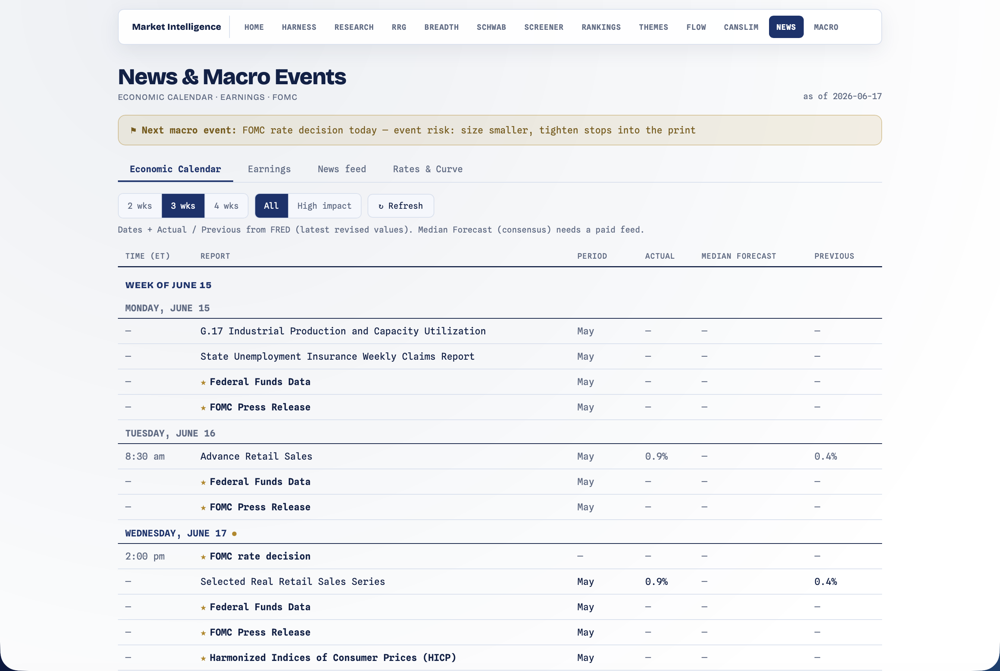

# News — News & Macro Events

[← Back to main README](../../README.md)

  

A news & macro-events tracker that answers: *what market-moving events are coming, is event risk imminent, and what's the latest headline flow?* Built **free-first and fail-soft** — it works with **zero new API keys**, and a few free keys progressively enrich it.

Open at **http://localhost:8000/news.html**. No keys required; `FRED_API_KEY` / `FINNHUB_API_KEY` / `ALPHAVANTAGE_API_KEY` / `POLYGON_IO_KEY` each light up more (see [setup](../../README.md#one-time-setup)).

---

## What it shows — four live tabs

### Economic Calendar (week-by-week)

A MarketWatch-style grid, Monday→Friday, each weekday carrying its scheduled FOMC + econ-release events. Columns: **Time (ET) · Report · Period · Actual · Median Forecast · Previous**.

- **Dates** come from FRED's exact release calendar when `FRED_API_KEY` is set; without a key they fall back to an approximate monthly generator (NFP = first Friday is exact; CPI/PPI/GDP/PCE are nominal and labelled "approximate").
- **Actual / Previous** fill from FRED's latest revised values when keyed (a release in month M reports M-1, so Actual is blank until that period publishes). **Median Forecast is always blank** — consensus has no free source.

### Earnings

A week-by-week earnings grid: **Time (ET) · Symbol · Period · EPS Est. · EPS Actual**. With `FINNHUB_API_KEY` it pulls the **broad** calendar (relevance-filtered to your focus list ∪ S&P 500) with EPS estimate/actual; without a key it falls back to the focus list's earnings dates (date + symbol only).

### News feed

A reverse-chronological, day-grouped headline feed (**Time · Source · Headline · Tickers · Sentiment**) over four fail-soft sources: market RSS (CNBC / MarketWatch / Yahoo, no key), SEC **8-K** material events for the focus list (no key), and **AlphaVantage** / **Polygon** sentiment + ticker tagging (keyed). A **Focus-only** toggle keeps items tagged with one of your positions/watchlist tickers.

### Rates & Curve

The macro-pricing read (FRED-keyed): Treasury yields + fed funds + curve spreads, each with 1D/1W/1M change in basis points, a yield-curve mini-chart (3M→30Y), and an **inversion read** (10Y–2Y / 10Y–3M negative = a late-cycle/recession-risk flag — directly relevant since sector rotation is a rates story).

> **Why no fed-funds-rate probabilities?** Deliberately deferred — it's context, not alpha (already priced in), and the hardest data to source free. The breadth regime + the rotation gate + bond-sector RS already approximate the signal.

---

## The signal hook — event risk

`event_risk(horizon=10, alert_days=2)` finds the soonest **high-impact** FOMC/econ event within the horizon; its `flag` trips when that event is ≤ 2 days out ("size smaller, tighten stops into the print"). This is wired into the rest of the app as a **frontend fetch** (not a backend cross-import, which would violate the dependency order): the [Schwab](../schwab/README.md) and [Breadth](../breadth/README.md) pages overlay an amber event-risk banner, and the hub card badge reads `/api/news/summary`.

---

## How it's assembled

`sources.py` holds the source adapters (the breadth datasource pattern — stdlib `urllib` + `xml.etree`, every source fail-soft to `[]`). `calendar.py` fetches them all, upserts into the store, and builds the week grids / feed / rates on a TTL-cached, single-flight refresh (30 min; no daemon — the first request after the TTL refreshes inline). `POST /api/news/refresh` forces it. Importance is keyword-classified (`high`/`med`/`low`) and `low` is dropped to keep the calendar to market-movers.

**Dependency position:** a low consumer — it imports nothing but `modules.Response` at load time, and reaches *up* (into `screener.store` / `breadth.store` for the earnings relevance filter + focus list) only via lazy, in-function, fail-soft imports.

---

## Routes

| Method | Path | Purpose |
|---|---|---|
| GET | `/news.html` | the page |
| GET | `/api/news/calendar?track=econ\|earnings&weeks=N&importance=high` | the week grid |
| GET | `/api/news/feed?focus=&limit=&days=` | the headline feed |
| GET | `/api/news/rates` | Rates & Curve |
| GET | `/api/news/event-risk` | the event-risk hook (banners) |
| GET | `/api/news/summary` | hub badge |
| POST | `/api/news/refresh` | force a refresh |

CLI: `python3 -m modules.news.cli [--days N] [--high] [--json]` (a flat upcoming list).

## Files

| File | Role |
|---|---|
| `__init__.py` | calendar route handlers + routes (init the store) |
| `sources.py` | FOMC / econ / earnings / Fed-RSS / market-RSS / 8-K / AlphaVantage / Polygon adapters + FRED helpers |
| `calendar.py` | refresh → TTL → week calendar + news feed + rates + `event_risk` + summary |
| `store.py` | SQLite store (events with upsert-dedupe + an `extra` JSON column) |
| `cli.py` | `python3 -m modules.news.cli` |
| `news.html` | the four tabs (white/navy) |

Unit tests live in [`tests/test_news_calendar.py`](../../tests/test_news_calendar.py) (no network — fake sources against a temp DB).

> Educational only. Calendar dates/values without keys are approximate; Median Forecast is always blank (no free consensus feed). Confirm anything time-sensitive against the official source.
