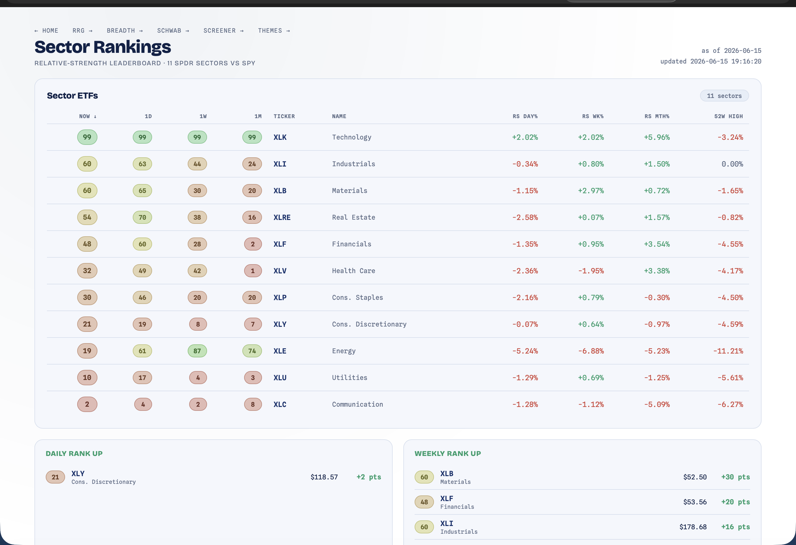

# Rankings — Sector Leaderboard

[← Back to main README](../../README.md)

  

A scannable relative-strength leaderboard for the 11 SPDR Select Sector ETFs, benchmarked against SPY. Where the [RRG](../rrg/README.md) shows *direction of travel* on a chart, Rankings answers a flatter question at a glance: **which sectors are strongest right now, and which are gaining or losing ground?**

Open at **http://localhost:8000/rankings.html**. The core leaderboard needs only Yahoo Finance (no key); the top-stocks-per-sector drill-down reuses the [Screener](../screener/README.md)'s synced data where available.

---

## What it shows

### Sector leaderboard

A sortable table, one row per sector, with:

- **NOW** — a **0-99 relative-strength rank** (colored pill, green → amber → red).
- **1D / 1W / 1M** — that same rank as it stood 1 day, 1 week, and 1 month ago, so you can see a sector climbing or fading.
- **RS Day% / Wk% / Mth%** — relative strength = the sector's return minus SPY's, over 1 / 5 / 21 trading days.
- **52W High** — how far below its 52-week high the sector closed.

### Rank movers

Four small cards — **Daily Rank Up / Down** and **Weekly Rank Up / Down** — list the sectors whose rank rose or fell the most (in points) over a day and over a week. This catches rotation *as it happens*, before it's obvious in the table order.

### Top stocks per sector

Pick a sector and the drill-down lists 15 names, with a toggle:

- **Relative Strength** — the strongest stocks *classified* into that sector (across the synced universe), ranked by 1-month RS vs SPY.
- **Top Holdings** — the ETF's **actual** top holdings by index weight (pulled live from the fund's holdings, ~10 names), with their weights and prices.

In Relative-Strength mode each name also shows its historical **flag win-rate** (e.g. ▲58%) — how often a bull/bear flag on that stock continued in the pole's direction, regime-conditioned and read from the Screener's background-precomputed table (~90-day cache). A volume-exhaustion badge (climax↑ / climax↓) appears when the latest bar is a capitulation / blow-off.

---

## How the rank works

The 0-99 score is **not** an ordinal 1-of-11 ladder (which would just read 100/90/80… and barely move day to day). It's a **pooled-historical percentile**:

1. For each sector, build a relative-strength composite — a weighted blend of its RS-vs-SPY return over several lookbacks (≈ 21 / 63 / 126 days).
2. Pool that composite across all 11 sectors over the full ~3 years of history into one reference distribution.
3. Map each sector's current composite to its percentile (0-99) in that pool.

Because the reference is the whole history of all sectors, the ranks **spread non-uniformly** (a genuinely strong sector sits near the top of everything it's ever printed) and **move smoothly**, which is what makes the day-over-day "rank movers" deltas meaningful. The 1D/1W/1M columns are the same mapping applied to the composite as it stood on those past dates.

This reuses the RRG module's relative-strength math and its cached price fetch — no duplicate downloads.

---

## Data sources

| Piece | Source |
|---|---|
| Sector ranks, RS%, 52W-high | Yahoo Finance (the RRG module's cached close fetch) |
| Top stocks by **Relative Strength** | the Screener's sector tags + RS snapshot (`screener.db`) |
| Top stocks by **Holdings** | the fund's published top holdings (via `yfinance`), enriched with snapshot prices |

The RS leaderboard works on its own. The **top-stocks** drill-down depends on the Screener having synced fundamentals + a snapshot; if a sector has nothing synced yet, it shows a "run a screener sync" note and the rest of the page still works (fail-soft).

---

## Routes

| Method | Path | Purpose |
|---|---|---|
| GET | `/rankings.html` | the page |
| GET | `/api/rankings` | leaderboard + movers + RS leaders (one payload) |
| GET | `/api/rankings/holdings?sector=XLK` | the ETF's real top holdings (on demand, cached) |
| GET | `/api/rankings/summary` | the leading sector + rank (drives the hub badge) |

## Files

| File | Role |
|---|---|
| `__init__.py` | RS-composite → pooled-percentile rank math, movers, holdings fetch, routes |
| `rankings.html` | leaderboard table, mover cards, top-stocks toggle (white/navy) |

Unit tests live in [`tests/test_rankings.py`](../../tests/test_rankings.py).

> Educational only. Ranks are a relative-strength read, not a forecast — confirm with price trend.
