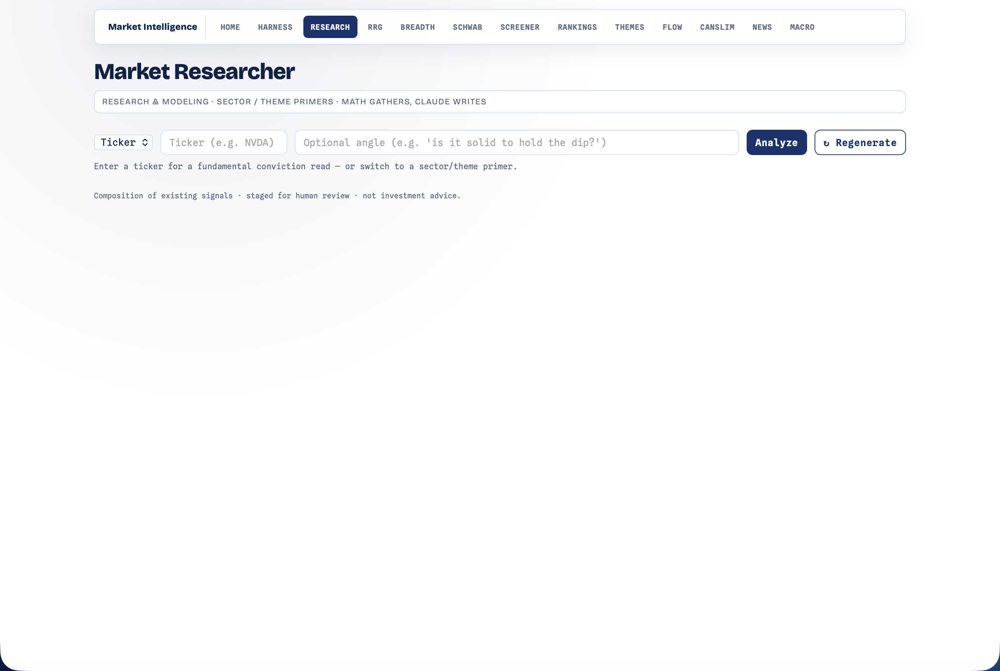

# Research — Fundamental Researcher

[← Back to main README](../../README.md)

  

A research subagent inspired by anthropics/financial-services' "Research & modeling" agents. Its primary job: a **per-ticker fundamental-conviction read** that backs whether a name is solid enough to **hold/size** behind a technical setup — if the move stalls, does the company have the quality to keep? It also does sector/theme **primers** as a secondary lens.

Open at **http://localhost:8000/research.html**. Like [CANSLIM](../canslim/README.md)/[Themes](../themes/README.md) it's **composition, not new quant**, and like the [Harness](../harness/README.md) it follows *math decides, the LLM explains* — a deterministic engine gathers/scores every figure; the LLM only writes the prose.

---

## Per-ticker fundamental conviction (the headline)

Enter a **ticker** → a **0-99 score + a Strong / Solid / Mixed / Weak verdict**, the fundamental counterpart to the harness's technical IMPULSE. `fundamental_score(row)` is pure and **self-contained** (well-defined for any single ticker, no cross-sectional dependency), blending six sub-scores:

| Sub-score | Reads |
|---|---|
| **growth** | EPS quarterly + annual growth (CANSLIM's growth scorer, unit-tolerant) |
| **demand** | the accumulation A–E rating (the institutional buy/sell footprint) |
| **institutional** | sponsorship level band (% held) |
| **valuation** | P/E sanity |
| **trend** | price vs 50/200d + %-off-52w-high + RSI extremes |
| **rs** | relative strength vs SPY |

The composite is a weighted blend (`FUND_WEIGHTS`, renormalized over the sub-scores that are present). `analyze_ticker(symbol)` reuses the harness's hybrid fetch (`picks._rows` — the screener snapshot when synced, else yfinance `.info`/OHLCV on demand, so **any** symbol works), scores it, attaches **sector/regime context** (the name's SPDR sector's RRG rotation call + the macro regime + earnings/event risk), and narrates a **bull case / risks / what-would-change-the-view / bottom-line** note via the `claude` CLI (fail-soft → a deterministic template).

---

## "Supports conviction" — wired into the harness

This is the integration that makes the score *do* something: `picks._attach_fundamentals` attaches `fundamental_score(row)` to each watchlist row, and `picks._hold` **blends it into the HOLD axis** (`FUND_BLEND = 0.45`), so a name's fundamental conviction flows straight into its paper-trade size. The suggestion carries `fund_score` / `fund_verdict`, which the harness **chat** grounds on. Fail-soft: with research unavailable, HOLD is the old CANSLIM/proxy math unchanged.

The picks↔research edge is **mutual but lazy/in-function** (research → `picks._rows` in `analyze_ticker`; `picks` → `research.fundamental_score` in `suggest()`), so there's no module-load cycle.

---

## Sector / theme primer (secondary)

Pick a sector or theme → an industry overview (rank + rotation call + regime), a competitive landscape (RS leaders + ETF holdings), a peer-comps spread, and an ideas shortlist (thesis hooks). The original "Market Researcher" lens, reusing `rankings` / `rrg` / `screener.store` / `themes` / `macro` / `news` + the same narrator.

---

## Position in the project

A **top consumer alongside the harness** — nothing imports it back, and it has no module-load cross-imports (only `modules.Response`). It reaches into `rankings` / `rrg` / `screener.store` / `themes` / `macro` / `news.calendar` / `schwab` and reuses `harness.agents.claude_cli` + `harness.picks._rows` via lazy, in-function, fail-soft imports, so a missing/erroring module degrades one section rather than crashing. Unlike the harness it casts **no vote** — it supports conviction through the pick HOLD blend, not the combiner. On-demand + cached (a 30-min memory TTL + `data/primer_<type>_<id>_<date>.json`).

---

## Routes

| Method | Path | Purpose |
|---|---|---|
| GET | `/research.html` | the page |
| GET | `/api/research/ticker?symbol=&angle=` | the per-ticker fundamental deep-dive |
| GET | `/api/research?type=ticker\|sector\|theme&id=&angle=` | dispatch (cached) |
| GET | `/api/research/targets` | the picker's available sectors/themes |
| GET | `/api/research/summary` | hub badge |
| POST | `/api/research/run` | force-regenerate |

## Files

| File | Role |
|---|---|
| `__init__.py` | `fundamental_score` + `analyze_ticker` + `build_research` evidence assembly + the narrator + template fallbacks + routes |
| `research.html` | target picker + primer (markdown) + landscape/peer-comps tables + ideas shortlist (white/navy) |

Unit tests live in [`tests/test_research.py`](../../tests/test_research.py) (no network, no LLM — every cross-module reach is patched).

> Educational only. The conviction read is a quality screen, not a price target — confirm with price trend and your own due diligence.
