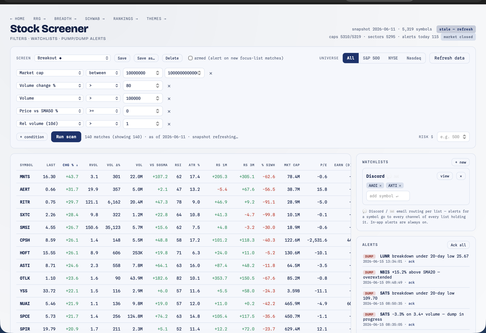
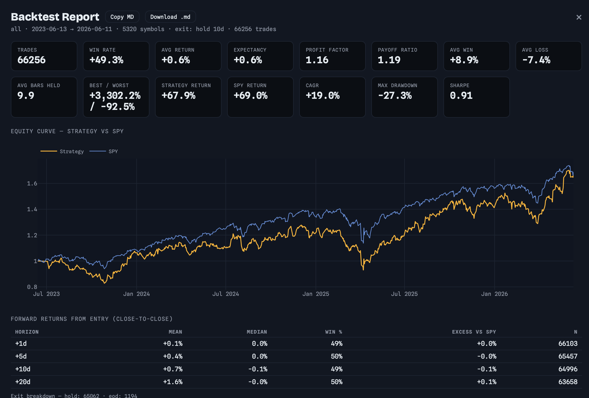

# Screener — Stock Screener, Watchlists & Pump/Dump Alerts

[← Back to main README](../../README.md)

A TradingView-style screener over the full synced market (S&P 500 ∪ NYSE ∪ Nasdaq, ~5,300 symbols), with savable named screens, user-created watchlists, intraday **pump/dump alerts** on a focus list of your Schwab positions and watchlist symbols, and a **strategy backtester** that replays your screen over history. Alerts surface in-app and can route to Discord and email per watchlist.

<p align="center">
  
</p>

Open at **http://localhost:8000/screener.html**. Reads daily bars from the [Breadth module](../breadth/README.md)'s store, so run a breadth sync first (the screener needs synced universes to scan).

---

## What it does

- **Screen** the whole market with a condition builder — price/volume/RVOL, SMA & **EMA** relations (5/10/20/50/100/200), RSI, ATR, relative strength vs SPY (1m/3m), 52-week distances, gaps, **golden-pocket** Fibonacci state, **bull/bear flag** state, **volume buyer/seller exhaustion**, market cap, P/E, dividend yield, beta, days-to-earnings, sector, and the sector's RRG call as a filterable column.
- **Save** named screens; nine presets ship built in (the first two are your real TradingView presets):
  - **Breakout** — MktCap 10M–10T · Vol chg > 80% · Vol > 100k · Price ≥ 50SMA · RVOL > 1
  - **Continuation** — Price > 50SMA · Chg > 2% · MktCap 100M–10T · Vol chg > 80% · Vol > 100k · Price > 150SMA
  - **Volume Building** — RVOL ≥ 2 · \|Chg\| ≤ 3% · Vol > 100k — heavy tape while price is still quiet (volume leading price, the pre-pump read); deliberately no trend filters, so clone and tighten
  - **Golden Pocket** — price inside the bullish 0.618–0.786 retracement of its latest up-swing
  - **Approaching Golden Pocket** — price retraced 0.5–0.618 toward that pocket (lead time before it arrives)
  - **Bull Flag / Bear Flag** — an impulsive flagpole + a brief, shallow, tapering-volume consolidation (continuation pattern)
  - **Selling Climax / Buying Climax** — a volume spike into a new low/high that closes strong/weak (capitulation / blow-off — a bottoming / topping tell)
- **Watch** symbols in named lists; ★ any scan row to add. The **Risk $** input adds a Shares column = `floor(risk ÷ ATR14)` for volatility-based position sizing.
- **Get alerted** when a position or watchlist symbol shows a pump/dump signal, in-app (feed + home-hub badge + dots on the Schwab page) and optionally via Discord/email.
- **Backtest** the current screen as an entry signal over history — win rate, expectancy, profit factor, forward returns vs SPY, and an equity curve, exportable to Markdown (see [Backtester](#backtester) below).

---

## Architecture: snapshot + live patch

Scans never compute indicators per-request. A background job rebuilds a **snapshot table** — one indicator row per symbol — from the breadth bars store in ~5s whenever bars are newer than the snapshot. Scan requests are then sub-second pandas filters over that ~5,300-row table. The scan handler auto-kicks a rebuild when the snapshot is stale and serves the previous one in the meantime.

The intraday **poller** live-patches only the focus-list rows in memory from Schwab quotes (running `totalVolume`, last price, gap), so alerts catch same-day moves without re-touching the whole table. Bars themselves are never duplicated — they're read from breadth's SQLite store.

---

## Filter engine

A screen is a JSON condition list `[{field, op, value}]`, ANDed together. Operators: `> >= < <= == != between in`.

**NaN never matches** (TradingView semantics) — a symbol with no market cap fails every market-cap condition rather than slipping through a `!=` or `<`. The `FIELDS` registry (`filters.py`) drives both server-side validation *and* the frontend's field dropdown (served via `/api/screener/fields`), so adding a field is a one-place change.

Rolling high/low *levels* are stored shifted one day, so "price crosses yesterday's 20-day / 52-week high-low" is detectable against them; `% off 52-week high` uses the inclusive extreme so a fresh high reads as 0.

### EMA distances & the golden pocket

- **EMA distances** — `price_vs_ema{5,10,20,50,100,200}_pct` join the existing SMA-distance fields. "Above the 20 EMA" is just `price_vs_ema20_pct > 0`.
- **Golden pocket** — `golden_pocket()` finds the most recent swing leg and reports where price sits in its Fibonacci retracement. Pivots are *strict* local extremes over ±5 bars (strictness ignores flat runs) and are confirmation-lagged so there's **no lookahead**. The more recent of the last swing high/low picks the leg: a recent high ⇒ *bullish* (price retracing down into support), a recent low ⇒ *bearish* (price bouncing up into resistance). Filterable fields:
  - `gp_direction` — `bullish` / `bearish`
  - `gp_retrace` — 0–1 position within the leg
  - `gp_in_pocket` — `1` when retrace is in the 0.618–0.786 golden pocket
  - `gp_approaching` — `1` when retrace is 0.5–0.618 (on its way in, not there yet; excludes anything past 0.786)
  - `gp_zone_low` / `gp_zone_high` — the pocket as actual price levels

### Flags & volume exhaustion

These reuse the RRG module's `flags` / `exhaustion` leaves (one definition shared with the rotation engine), expressed as vectorized snapshot fields here — both no-lookahead (trailing windows only):

- **`flag`** — `bull` / `bear` / `none`. A strong **flagpole** (≥6% move over ~10 bars) followed by a brief, shallow consolidation (retrace ≤45% of the pole) on **tapering volume** → continuation in the pole's direction.
- **`exhaustion`** — `buyer` / `seller` / `none`. A **volume climax** (≥2× the 20-day average) into a new 20-bar high/low that closes in the weak/strong end of its range — buyer exhaustion (a topping blow-off) or seller exhaustion (a capitulation bottom).

A separate background job also precomputes each universe symbol's **historical flag win-rate** (regime-conditioned, **~90-day per-symbol cache**); those are read by the Rankings and Themes pages to show how reliable a name's flags have been.

---

## Fundamentals (market cap, P/E, sector, earnings)

Schwab-first, yfinance fills the gaps:

1. **Schwab instruments** (`instruments?projection=fundamental`, batched 100 symbols/call) → market cap, shares outstanding, 10-day avg volume, P/E, dividend yield, beta. Full universe in ~1 minute. (Schwab reports missing numerics as `0.0`; those are stored as NULL.)
2. **yfinance gap-fill** for any symbol Schwab left without a market cap.
3. **Earnings dates** via yfinance, **focus list only** (a full-universe calendar fetch is too slow) — so the Earnings column is populated for your positions and watchlists, NaN elsewhere.
4. **Sector classification** via yfinance for the long tail (the only source for sector) — this is the slow phase and builds gradually across background runs; sector/RRG filters simply skip unclassified symbols until filled.

All phases are resumable via per-symbol status — interrupt and hit **Refresh data** to continue.

---

## Alerts

### Signals (heuristics, constants at the top of `rules.py`)

| Rule | Fires when | Kind |
|---|---|---|
| Volume + price thrust | RVOL ≥ 3 **and** \|change\| ≥ 3% | pump / dump |
| Volume building | RVOL ≥ 2 **while** \|change\| < 3% | pump / dump |
| RSI extreme | RSI14 ≥ 80 / ≤ 20 | dump / pump |
| MA stretch | price ±15% from SMA20 | dump / pump |
| Level break | crosses prior-day 20-day or 52-week high/low (52w suppresses the 20d echo) | pump / dump |
| Gap | gap ≥ ±4% | pump / dump |
| Earnings proximity | earnings within 7 days | info |

**Volume building vs. thrust.** The thrust rule fires once a move is already underway (RVOL *and* price both moving); volume building catches the earlier stage — heavy tape while price is still flat — since volume tends to lead price. The two are mutually exclusive at any instant (the `< 3%` change gate), but they're separate rule keys, so a name that quietly accumulates in the morning and then breaks out can fire **building → thrust on the same day**. Tune `RVOL_BUILD` (default 2.0) at the top of `rules.py` if the open-bell tape is too noisy.

Technical extremes carry the kind of the *reversal* they warn about — overbought is a `dump` warning on a holding, washed-out is a `pump` (bounce) candidate.

### Armed screens

Any saved screen can be **armed**: when a focus-list symbol *newly* matches it (wasn't matching on the previous evaluation), it fires an `info` alert. This unifies "screener settings" and "alerts" — build a screen, arm it, and you're notified when one of your names enters it.

### Dedupe

Structural: `UNIQUE(date, symbol, rule_key)` + `INSERT OR IGNORE`, so each rule fires **at most once per symbol per day**, and external channels only ever see newly inserted rows — they can't be spammed by repeated ticks.

### Cadence

The poller is a singleton daemon, auto-started with the server. It ticks every 180s during **9:30–16:00 ET, Mon–Fri** and idles otherwise (holidays unmodeled — empty polls are harmless). An end-of-day pass runs after each snapshot rebuild, reusing the exact same alert path, so a move on a day the app was off intraday is still caught that evening.

---

## Delivery & channel routing

In-app delivery is always on (the alerts feed, the home-hub badge, and dots on the Schwab positions page). Beyond that, **each watchlist** carries channel toggles:

- An alert for symbol **S** goes to every channel of every watchlist holding S, plus the "positions alerts" channel setting for held symbols.
- New alerts per pass are batched into **one Discord post / one email**.
- Delivery is fail-soft — a channel error is recorded in status and never blocks the poller.

Configure channels in `.env` (a channel shows "not configured" in the UI until its keys exist):

```
DISCORD_WEBHOOK_URL=https://discord.com/api/webhooks/...
SMTP_HOST=smtp.gmail.com
SMTP_PORT=465
SMTP_USER=you@gmail.com
SMTP_PASS=your_app_password
ALERT_EMAIL_TO=you@gmail.com
```

For Gmail use an [app password](https://support.google.com/accounts/answer/185833), not your account password. Per-channel **test** buttons live in the alerts panel.

---

## Backtester

The screener doubles as a strategy backtester (sidecar panel → **Run ▸**). It takes the **current screen conditions as an entry signal** and replays them over history, so "finding a confluence of signals" and "validating it" are the same workflow.

<p align="center">
  
</p>

**How it works.** The same indicator math that builds the live snapshot (`metrics.compute_indicator_panels`) is computed over the *full* history, and for each trading day the backtester rebuilds the same cross-section the scanner filters and runs the same condition engine — so the backtest sees exactly what a live scan would have. Matches become entry signals.

- **No lookahead, long-only.** Entries fire on signal *onset* (matched today, not yesterday — a persistent signal opens one trade, not one per day) and execute at the **next bar's open**.
- **Exit models** (your choice per run):
  - **Hold N days** — exit after a fixed number of bars.
  - **ATR stop / target** — stop at `entry − k·ATR14`, target at `entry + k·ATR14` (stop checked first).
  - **Until signal gone** — exit the first day the symbol stops matching the screen.
- **What it reports** — trade stats (win rate, expectancy, profit factor, payoff, avg win/loss, avg bars held, best/worst), a **forward-return study** at +1/5/10/20 days with the excess vs SPY, an equal-weight daily **equity curve vs SPY** (total return, CAGR, max drawdown, Sharpe), and a trade-return histogram. **Copy MD / Download .md** export the whole report as Markdown.
- **ML-ready.** Every trade also records its full signal feature vector at entry, so a classical-ML ranking layer (logistic / gradient boosting on those features) can train on the same records later — no model ships in v1.

Runs synchronously (S&P 500 over 3 years ≈ 4s); default universe is S&P 500 (use the Universe toggle — *All* is much slower). `POST /api/screener/backtest` with `{conditions|screen_id, universe, start, end, exit}`.

**Caveats it surfaces in the report:** fundamentals, earnings, and the sector RRG call use latest-known (not point-in-time) values — `rrg_call` has no history and matches nothing in a backtest; the universe is today's membership list, so deeply delisted names are absent (survivorship).

---

## Routes

The router is exact-path GET/POST, hence POST-verb CRUD:

| Method | Path | Purpose |
|---|---|---|
| GET | `/screener.html` | page |
| GET | `/api/screener/status` | snapshot/fundamentals/poller/alerts state |
| POST | `/api/screener/refresh` | start a background refresh `{kind?}` |
| GET | `/api/screener/progress` | refresh job status (2.5s poll) |
| GET | `/api/screener/fields` | field registry + ops (drives the UI) |
| POST | `/api/screener/scan` | run a screen `{conditions\|screen_id, universe, symbols?, sort, dir, limit}` |
| POST | `/api/screener/backtest` | backtest a screen `{conditions\|screen_id, universe, start, end, exit}` |
| GET / POST | `/api/screener/screens[/save\|delete\|arm]` | screens CRUD |
| GET / POST | `/api/screener/watchlists[/save\|delete]` | watchlists CRUD |
| GET / POST | `/api/screener/alerts[/ack]`, `/alerts/summary` | alerts feed, ack, summary |
| POST | `/api/screener/notify/test` | send a test message `{channel}` |
| POST | `/api/screener/settings` | `{positions_channels}` |
| POST | `/api/screener/poller` | `{action: start\|stop}` |

`alerts/summary.by_symbol` is what drives the home badge and the Schwab-page alert dots.

---

## Files

| File | Role |
|---|---|
| `__init__.py` | route handlers + scan assembly + `register_routes()` |
| `store.py` | SQLite store (snapshot, fundamentals, screens, watchlists, alerts) |
| `metrics.py` | pure pandas indicator math — `compute_indicator_panels` (full history) / `compute_snapshot` (last row); EMAs, golden pocket (unit-tested) |
| `filters.py` | JSON condition engine + `FIELDS` registry (unit-tested) |
| `backtest.py` | strategy backtester — replays the scan over history (unit-tested) |
| `rules.py` | pump/dump heuristics + armed-screen logic (unit-tested) |
| `quotes.py` | Schwab rich quotes + batched instruments fundamentals |
| `snapshot.py` | background jobs: snapshot rebuild + fundamentals refresh |
| `notify.py` | Discord webhook + SMTP email delivery, per-watchlist routing |
| `poller.py` | intraday quote poller + shared scan-frame / alert pass |

Local data lives in `data/screener.db` (gitignored, WAL mode). Pure-logic modules are unit-tested in `tests/test_screener_*.py`.
