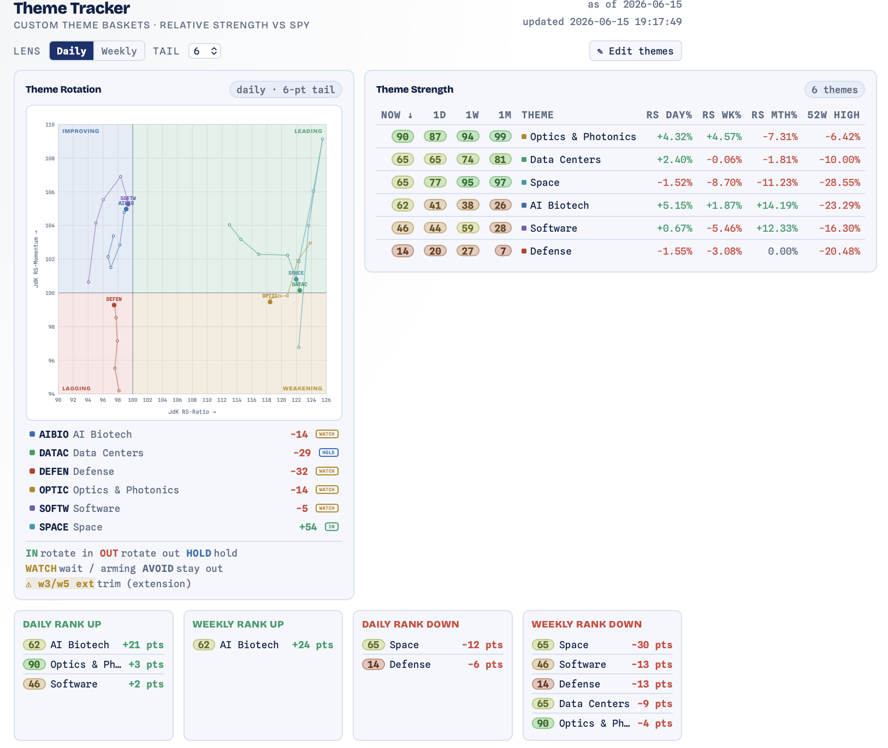

# Themes — Theme Tracker

[← Back to main README](../../README.md)

  

Track **custom investment themes** the same way the [Rankings](../rankings/README.md) and [RRG](../rrg/README.md) modules track sectors. A theme is a hand-picked basket of stocks (e.g. *AI Biotech* = RXRX, SDGR, TEM, …); the tracker turns each basket into an equal-weight index, scores it 0-99 vs SPY, plots all the themes on a rotation chart, and lets you drill into the underlying names — and you edit the baskets right in the page.

Open at **http://localhost:8000/themes.html**. Needs only Yahoo Finance (no key) — it's self-contained.

Six themes are seeded to start: **Optics & Photonics, Data Centers, Software, Defense, Space, AI Biotech**. They overlap freely (a ticker can live in several) and are just starting points — refine them in the editor.

---

## What it shows

### Theme rotation (RRG)

The same Relative Rotation Graph as the sector RRG, but each dot is a **theme** instead of a sector ETF. Themes plot by relative strength vs SPY (x) and the momentum of that strength (y), rotate clockwise through the four quadrants, and carry a fading tail showing direction of travel plus an explicit **ROTATE IN / OUT / HOLD / AVOID / WATCH** call. Daily/weekly lens and a tail-length control, just like the sector chart. Click a theme in the legend to hide/show it; hover a dot for exact values.

### Theme strength leaderboard

A sortable table scoring each theme **0-99** by relative strength (the same pooled-historical-percentile method the Rankings module uses), with its rank a day/week/month ago and RS% / 52-week-high columns — plus the four **rank-mover** cards (daily/weekly up and down).

### Constituents

Pick a theme and see its stocks ranked by relative strength vs SPY (price, change%, RS 1-month and 3-month) — so you can see *which names* are driving a hot theme or dragging a cold one. Each name also shows its historical **flag win-rate** + a volume-exhaustion badge (read from the Screener's precomputed table; off-universe tickers simply leave the cell blank).

### Editor

An **Edit themes** panel to create, rename, and delete themes and edit their ticker lists (paste symbols separated by spaces or commas). Saves are stored locally; the page recomputes everything on reload.

---

## How a theme becomes a score

Each theme is collapsed into one **equal-weight total-return index**: the mean of its constituents' *daily returns*, compounded. Two deliberate choices:

- **Mean of returns, not of prices** — so a $900 stock can't dominate a $20 one; every name carries equal weight.
- **Skip missing data** — a young constituent only starts contributing from its first trading day, so a recent IPO doesn't distort the basket's earlier history (early history just reflects fewer names).

That synthetic index is then fed through the **existing** engines unchanged — the sector ranking math (→ the 0-99 score + movers) and the RRG math (→ quadrants, tails, calls). The constituent list is computed from the same prices. So the whole module is wiring on top of code that was already tested for sectors; there's no separate theme-specific quant to drift.

It all runs off **one cached price fetch** per load (a second fetch only when you switch the RRG to the weekly lens).

---

## Editing & storage

Themes are stored in a small local SQLite database (`modules/themes/data/themes.db`, gitignored), with the same create/update/delete pattern as the Screener's watchlists. The six built-in themes seed automatically on first run and are marked "built-in"; anything you add is your own. Deleting is permanent. Symbols are upper-cased and de-duplicated on save.

---

## Routes

| Method | Path | Purpose |
|---|---|---|
| GET | `/themes.html` | the page |
| GET | `/api/themes?timeframe=daily&tail=6` | ranking + RRG + constituents + theme definitions (one payload) |
| POST | `/api/themes/save` | create or update a theme (`{id?, name, description, symbols[]}`) |
| POST | `/api/themes/delete` | delete a theme (`{id}`) |
| GET | `/api/themes/summary` | the leading theme + rank (drives the hub badge) |

## Files

| File | Role |
|---|---|
| `__init__.py` | equal-weight index builder + reuse of the ranking/RRG engines + routes |
| `store.py` | SQLite theme CRUD + the seeded built-in themes |
| `themes.html` | RRG chart + ranking table + movers + constituents + editor (white/navy) |

Unit tests live in [`tests/test_themes.py`](../../tests/test_themes.py).

> Educational only. The seeded baskets are a starting point, not investment advice — curate them yourself, and confirm with price trend.
